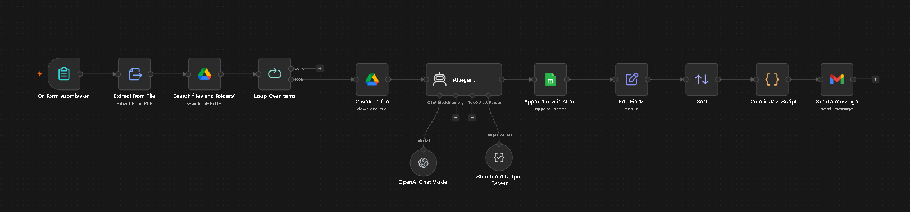
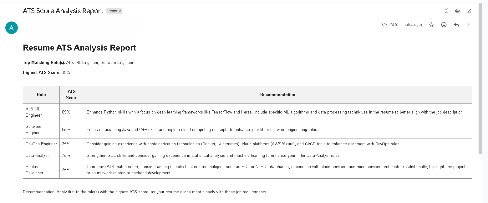
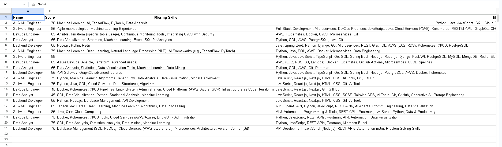
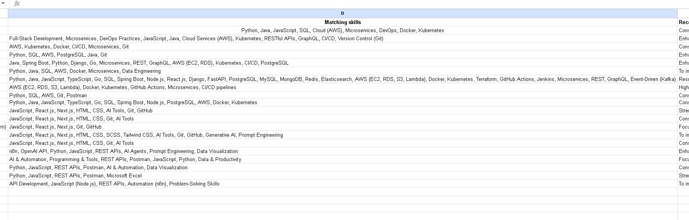
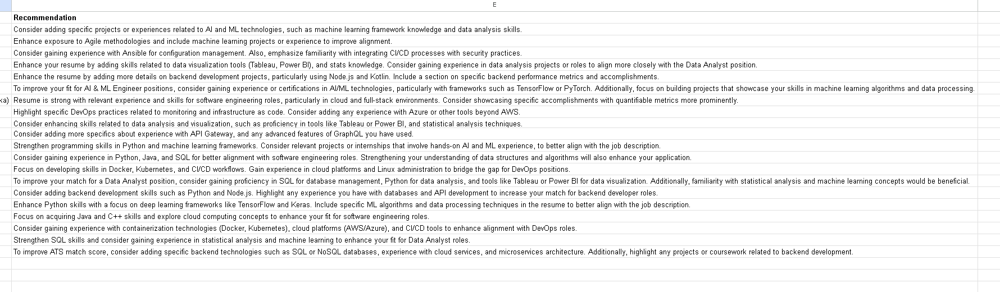

## Important Note

This repository contains a sanitized version of the workflow for demonstration purposes.

Before running the workflow, replace placeholder values and configure your own:

- OpenAI credentials
- Google Drive credentials
- Google Sheets credentials
- Gmail credentials


# Multi JD ATS Analyzer

An AI-powered ATS Resume Analyzer built with n8n that compares a candidate's resume against multiple job descriptions and identifies the best matching roles based on ATS compatibility scores.

## Overview

This project automates the resume screening process by analyzing a resume against multiple job descriptions stored in Google Drive. It generates ATS scores, identifies matching and missing skills, provides recommendations, stores results in Google Sheets, and emails a detailed report to the user.

## Features

- Resume Upload through n8n Form
- PDF Resume Text Extraction
- Multi Job Description Comparison
- AI-Powered ATS Scoring
- Missing Skills Detection
- Resume Improvement Suggestions
- Role Ranking Based on ATS Score
- Google Sheets Integration
- Automated Email Reports

## Workflow

1. User uploads resume through the form.
2. Resume text is extracted from the PDF.
3. Job descriptions are fetched from Google Drive.
4. OpenAI analyzes the resume against each JD.
5. ATS scores and recommendations are generated.
6. Results are stored in Google Sheets.
7. Roles are ranked based on ATS score.
8. A detailed report is emailed to the user.

## Technology Stack

- n8n Cloud
- OpenAI GPT-4o Mini
- Google Drive
- Google Sheets
- Gmail

## Repository Structure

```text
Multi-JD-ATS-Analyzer/
│
├── README.md
├── workflow/
│   └── Multi-JD-ATS-Analyzer.json
├── screenshots/
│   ├── workflow-overview.png
│   ├── email-report.png
│   └── google-sheet-results.png
└── docs/
    └── architecture-diagram.png
```


## Setup

To run this workflow:

1. Import the workflow into n8n.
2. Configure OpenAI credentials.
3. Configure Google Drive credentials.
4. Configure Google Sheets credentials.
5. Configure Gmail credentials.
6. Create a Google Drive folder containing job descriptions.
7. Create a Google Sheet using the provided schema.
8. Activate the workflow.


## Screenshots

### Workflow Overview



### Email Report


### Google Sheets Results





## Future Improvements


- Better ATS scoring methodology
- Industry-specific skill analysis
- Dashboard for analytics
- Multi-language support

## Author

**Aditya Kumar Yadav**

B.Tech Instrumentation and Control Engineering (2023–2027)

Passionate about AI Automation, n8n Workflows, and Generative AI Solutions.
